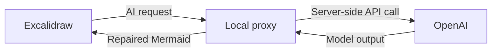
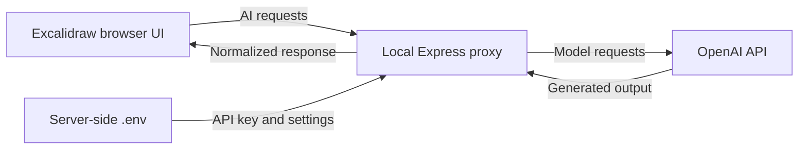

# Excalidraw AI Proxy

[](https://github.com/MCamner/excalidraw-ai-proxy/actions/workflows/ci.yml)
[](https://github.com/MCamner/excalidraw-ai-proxy/releases)
[](LICENSE)
[](https://github.com/MCamner/excalidraw-ai-proxy/pkgs/npm/excalidraw-ai-proxy)

A local Node.js proxy that enables Excalidraw OSS AI features without exposing
your OpenAI API key to the browser.

This repository is distributed as source through GitHub releases and is also published as the `@mcamner/excalidraw-ai-proxy` npm package on GitHub Packages.

It implements Excalidraw-compatible text-to-diagram and diagram-to-code
endpoints, repairs common Mermaid failures, and keeps model access and secrets
on the server.

> [!IMPORTANT]
> This repository is the AI backend proxy, not the Excalidraw editor. To use
> the AI features in the UI, install a local checkout of
> [Excalidraw OSS](https://github.com/excalidraw/excalidraw) and connect it to
> this proxy.

## Why use it?

- **Keep secrets server-side.** Excalidraw only connects to the proxy; the
  OpenAI API key remains in the proxy's local `.env`.
- **Use separate models per task.** Configure fast text-to-diagram and stronger
  multimodal diagram-to-code models independently.
- **Get import-ready Mermaid.** Deterministic sanitizing and optional model
  repair normalize output before Excalidraw receives it.
- **Run locally by default.** The proxy binds to `127.0.0.1` and only allows
  configured Excalidraw origins.
- **Diagnose compatibility quickly.** Health and capability endpoints expose
  the supported API surface without exposing secrets.

## Example

Prompt:

```text
Show a user request flowing through the proxy to OpenAI and back to Excalidraw.
```

Normalized Mermaid returned to Excalidraw:



The text-to-diagram endpoint buffers the model stream, removes incompatible
Mermaid syntax, optionally repairs invalid output, and then returns normalized
SSE chunks. See [examples](docs/EXAMPLES.md) for request and response shapes.

## Quick start

Requirements: Node.js 20 or later, npm, an OpenAI API key, and a local
Excalidraw OSS checkout.

Clone and install Excalidraw OSS in a separate directory:

```bash
git clone https://github.com/excalidraw/excalidraw.git
cd excalidraw
yarn
```

Then clone and install the proxy:

```bash
git clone https://github.com/MCamner/excalidraw-ai-proxy.git
cd excalidraw-ai-proxy
cp .env.example .env
npm install
```

Set your own key in the proxy's `.env`:

```env
OPENAI_API_KEY=your-openai-api-key
```

Start the proxy:

```bash
npm run dev
```

In the Excalidraw checkout, add this to `.env.local`:

```env
VITE_APP_AI_BACKEND=http://localhost:3016
VITE_APP_PORT=3003
```

Then start Excalidraw from that checkout:

```bash
yarn start
```

The default local addresses are:

- proxy: `http://localhost:3016`
- Excalidraw: `http://localhost:3003`

For prerequisites, verification, and custom origins, read the full
[installation guide](INSTALL.md).

## Supported API

| Endpoint | Purpose |
| --- | --- |
| `GET /health` | Basic liveness check |
| `GET /v1/ai/capabilities` | Supported features, models, limits, and streaming mode |
| `POST /v1/ai/text-to-diagram/chat-streaming` | Prompt to repaired Mermaid over SSE |
| `POST /v1/ai/diagram-to-code/generate` | Excalidraw image to self-contained HTML |

## Architecture



The browser never receives `OPENAI_API_KEY`. The proxy applies explicit CORS
origins, body limits, prompt limits, rate limiting, model timeouts, and Mermaid
normalization. It does not provide authentication or TLS termination; review
the [security policy](SECURITY.md) before exposing it beyond localhost.

## Configuration

`.env.example` is the source of truth for runtime settings. The main controls
are:

| Setting | Default | Purpose |
| --- | --- | --- |
| `PORT` | `3016` | Proxy port |
| `HOST` | `127.0.0.1` | Bind address |
| `ALLOWED_ORIGINS` | localhost on port `3003` | Browser origins allowed by CORS |
| `OPENAI_TEXT_TO_DIAGRAM_MODEL` | `gpt-4.1-mini` | Text-to-diagram model |
| `OPENAI_DIAGRAM_TO_CODE_MODEL` | `gpt-4.1-mini` | Diagram-to-code model |
| `MERMAID_AUTO_REPAIR` | `true` | Enable model-assisted repair fallback |
| `MAX_PROMPT_CHARS` | `6000` | Maximum text prompt length |
| `RATE_LIMIT_MAX_REQUESTS` | `20` | Requests allowed per rate-limit window |

For higher-quality diagram-to-code output, use a stronger multimodal model for
`OPENAI_DIAGRAM_TO_CODE_MODEL` while keeping text-to-diagram on a faster model.

## Documentation

| Document | Contents |
| --- | --- |
| [Quick start](QUICKSTART.md) | Minimal local setup |
| [Installation](INSTALL.md) | Prerequisites, configuration, and verification |
| [Examples](docs/EXAMPLES.md) | API request and response examples |
| [AI output contract](docs/AI_CONTRACT.md) | Mermaid generation and repair rules |
| [Architecture](docs/repo-diagram.md) | Repository flow and editable Excalidraw diagram |
| [Roadmap](docs/ROADMAP.md) | Completed phases and future constraints |
| [Security policy](SECURITY.md) | Private reporting and deployment scope |
| [Contributing](CONTRIBUTING.md) | Development and pull-request workflow |

## Development

Run the complete test suite:

```bash
npm test
```

The suite covers capabilities, HTTP endpoints, mocked OpenAI responses,
streaming semantics, prompt contracts, and Mermaid repair regressions. GitHub
Actions runs the same command for pushes and pull requests to `main`.

## License

Released under the [MIT License](LICENSE).

## Acknowledgements

Built for compatibility with
[Excalidraw OSS](https://github.com/excalidraw/excalidraw).

Thanks to the Excalidraw maintainers and contributors for the open-source
editor and its AI integration surface. This project is independent and is not
affiliated with or endorsed by Excalidraw.
