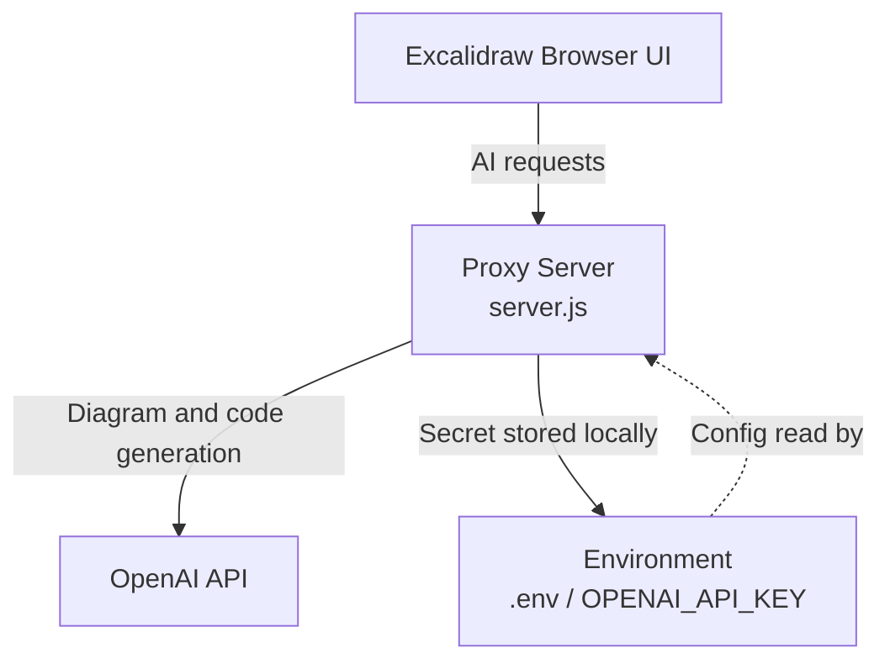

# Repository Diagram

This repo includes a visual architecture diagram in Excalidraw format:

- `docs/repo-diagram.excalidraw`

You can open that file in Excalidraw to inspect and edit the diagram.

## Repo architecture

## Notes

- The Excalidraw file is the source artifact for this diagram.
- The proxy server exposes the AI endpoints used by the browser.
- The OpenAI API key is kept server-side in `.env`.
